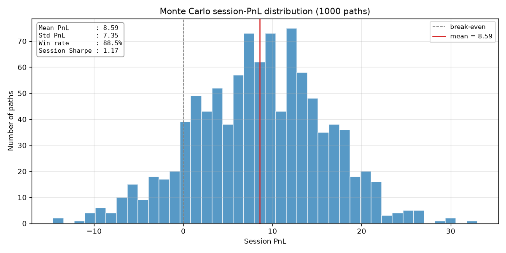
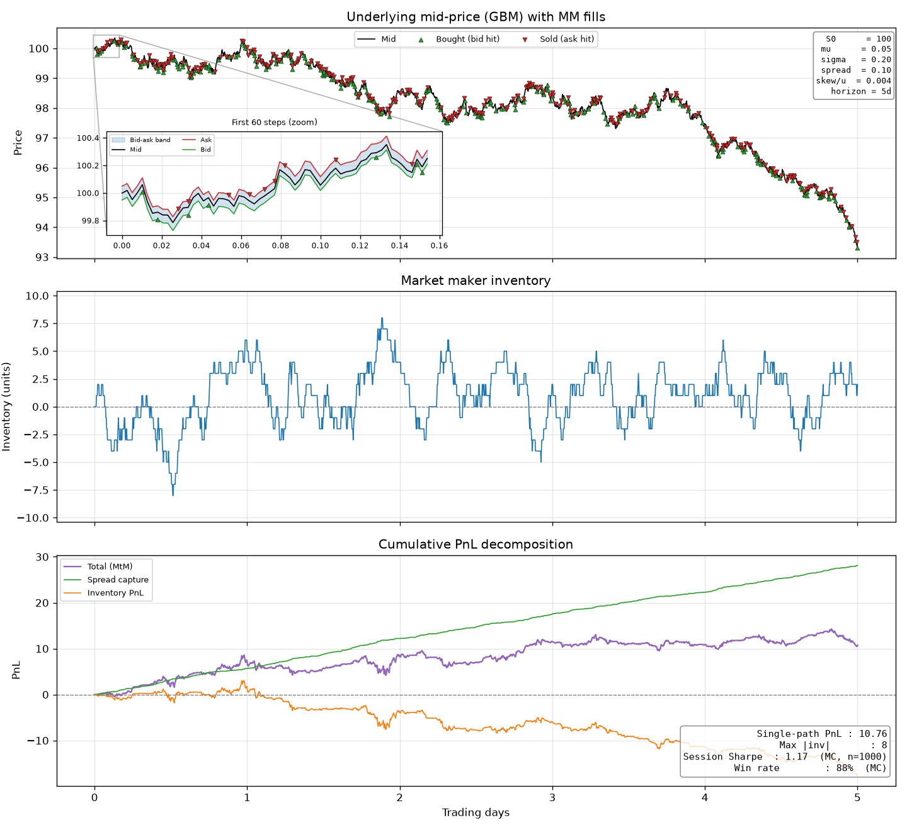
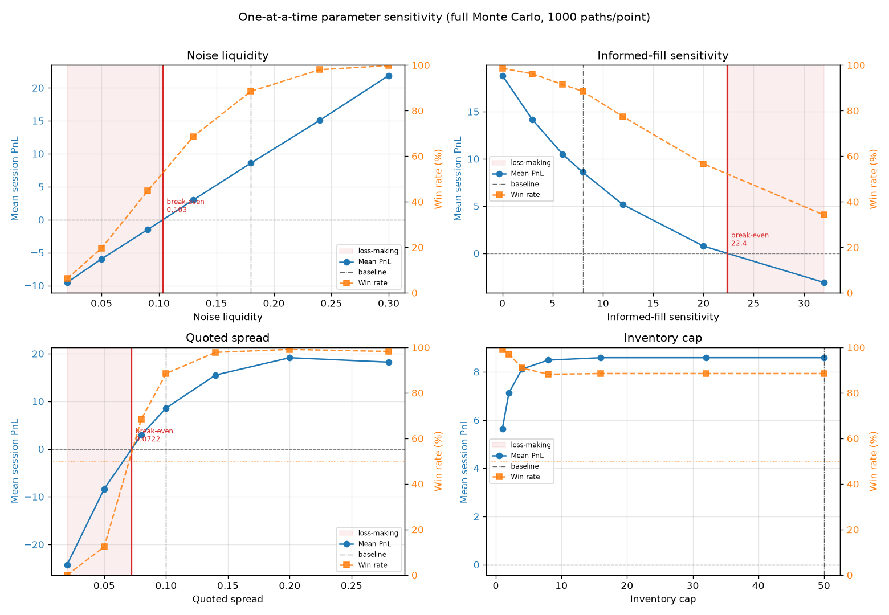

# Market-Making Simulator

A market-making simulator in Python that models a single asset as a random walk, separates informed from uninformed order flow, and manages inventory risk through quote skewing. Strategy performance is evaluated over a 1,000-path Monte Carlo, and a sensitivity analysis maps the regime in which the edge holds.

## Key results

Across a 1,000-path Monte Carlo, the strategy is **profitable in 88% of sessions**, with a mean session PnL of 8.59 and a session-level Sharpe of 1.17.

| Metric | Value |
| --- | --- |
| Mean session PnL | 8.59 |
| Std session PnL | 7.35 |
| Win rate | 88.5% |
| Session Sharpe | 1.17 |



## How it works

The mid-price follows geometric Brownian motion. At each step, the maker quotes a bid and an ask around the mid, skewing both against current inventory to pull the position back toward flat.

Order flow is split into two types:

- **Uninformed (noise) flow** arrives independently of price direction. This is where the maker earns the spread.
- **Informed flow** only trades when the price is about to move against the maker. This is the adverse-selection cost.

Profitability therefore comes down to one balance: the spread captured from uninformed flow must exceed the losses to informed flow. PnL is decomposed into spread capture and inventory PnL, and the decomposition is asserted to reconcile to the mark-to-market total.

The diagnostic plot below shows a single session: the mid-price with fills, the resulting inventory path, and the cumulative PnL split into spread capture (green) and inventory PnL (orange).



## Sensitivity analysis

The 88% result holds within a regime, not universally. The analysis below varies one parameter at a time, running the full Monte Carlo at each point on common random numbers so the differences reflect the parameter rather than sampling noise. Break-even points (where mean PnL crosses zero) are marked.



Main findings:

- **Quoted spread** is the dominant driver. Too tight and adverse selection outweighs the spread earned; PnL peaks at a wider spread (~0.20) before declining as fills thin out. Break-even ~0.072 against a baseline of 0.10.
- **Uninformed liquidity** drives profitability roughly linearly; break-even ~0.10 against a baseline of 0.18.
- **Adverse selection** (informed-fill sensitivity) would have to roughly triple from the baseline before the strategy turns unprofitable.
- **Inventory cap** barely matters above a small threshold, because the quote skew keeps positions well within bounds. The hard cap acts as a backstop rather than the control mechanism.

## Running it

Requires Python 3, NumPy and Matplotlib.

```bash
pip install numpy matplotlib
python market_maker_sim.py
```

This prints the summary statistics and saves the diagnostic, Monte Carlo and sensitivity plots.

## Limitations and possible extensions

- The sensitivity sweep is one-at-a-time, so it does not capture interactions between parameters. A natural next step is a 2D sweep of the two most sensitive parameters (spread and uninformed liquidity) or a global sensitivity analysis.
- The model abstracts away transaction costs, fees, latency, queue position and competition.
- The asset is a single synthetic GBM process with constant volatility and no jumps.
- A possible extension is to replace the heuristic inventory skew with the Avellaneda–Stoikov optimal quoting model and compare inventory control between the two.
